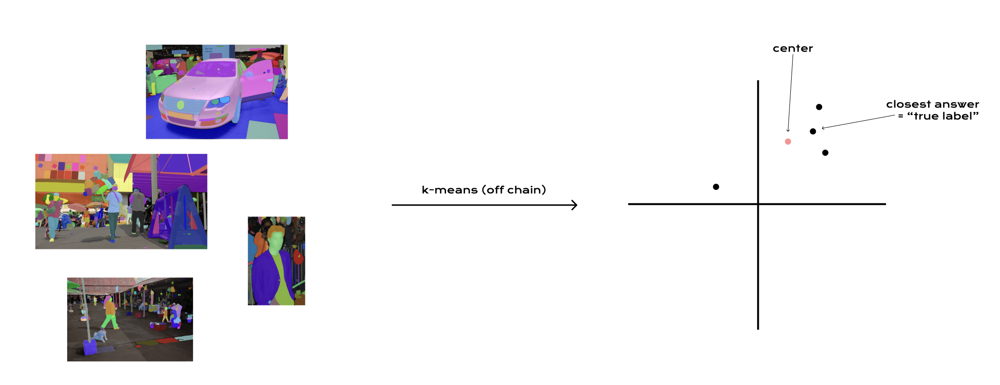

### user types

#### Sample Provider:
submits a sample and some tokens that will be used to pay out labelers

#### Labelers:
Need some deposited tokens as collateral
Can only submit one answer per sample

## - -

1. submit sample
2. labellers submit hashes to their answers during submission period
3. labellers submit (reveal) the url to their answers in the block after the submission period ends
    - confirm that the url matches the previously submitted hash
4. Distribute reward
    - distribution given by labelers k-means distance from the center
    - labelers are slashed of their deposit if:
        - their url and hash do not match
        - their answer is too far away from the average (above some threshold)
